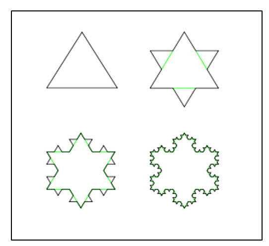
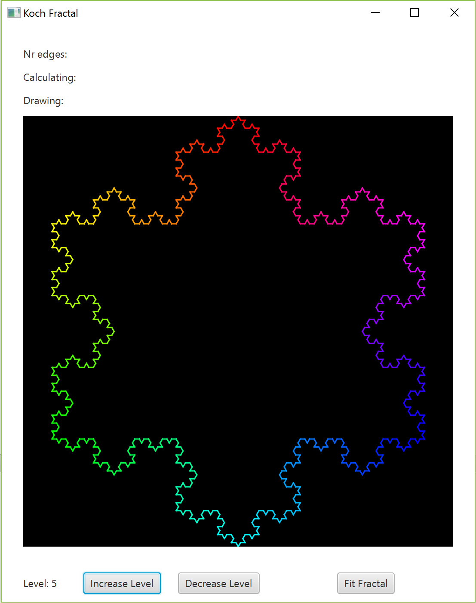

# UC – Opdracht week 5 & 6 

Deze opdracht bestaat uit 3 delen, en is bedoeld voor 2 weken.
 
We gaan een Java FX applicatie maken die een eenvoudige fractal tekent, de zogenaamde Koch fractal. Het tekenen van deze fractal begint met een driehoek, waarbij elke zijde vervolgens wordt opgedeeld in 4 lijnstukken. Dit proces kan willekeurig vaak herhaald worden, waarbij er steeds fijnere verdelingen gemaakt worden. Dit zijn de verschillende levels van de fractal. Als voorbeeld zijn hieronder de levels 1 t/m 4 weergegeven. 



Voor meer info over dit type fractal, zie http://nl.wikipedia.org/wiki/Koch-kromme. 

Doelstellingen
-	gebruiken van een GUI in Java FX
-	toepassen Observer/Observable patroon
-	executietijd van code meten
-	ervaren dat een langdurige berekening de GUI kan blokkeren

Voor deze applicatie zijn een aantal klassen gegeven:
1.	UCKochFractalFX (Java FX applicatie)
2.	KochFractal (klasse om de Koch fractal te berekenen)
3.	Edge (één lijnstuk van de Koch fractal)
Deze klassen hoeven in principe niet bekeken en niet veranderd te worden. 
Er is nog een andere klasse (KochManager) die je zelf moet schrijven.
Op de laatste 2 pagina's van deze opdracht zijn beschrijvingen van de klassen KochFractal en de Java FX applicatie UCKochFractalFX te vinden.
 
## Opdracht
We gaan achtereenvolgens de klassen KochFractal, Edge en UCKochFractalFX gebruiken. Deze klassen zijn te vinden in het UCKochFractalFX – startup.
### 1.	
Maak een console applicatie in NetBeans en kopieer het package calculate vanuit het KochFractal – startup project hierin. We gaan nu de coördinaten van alle edges van de fractal van level 1 uitrekenen en in het console tonen. Doe dit door in de main methode: 
- het KochFractal object te maken, 
- het level op 1 in te stellen en tenslotte 
- de 3 generate...Edge methodes één voor één aan te roepen.
Als we het hierbij zouden laten, zouden we geen resultaat zien omdat er geen Observer is voor de KochFractal Observable. 
Voeg een Observer toe die de edge-coördinaten print: 
- Maak in het package calculate een nieuwe klasse ConsoleObserver die de interface Observer implementeert, implementeer daarin de methode update, zodanig dat deze het begin- en eindpunt van een edge afdrukt (zorg voor een duidelijke begeleidende tekst in de output). De betreffende edge is te vinden in de tweede parameter (o1) van update. Deze kan bijvoorbeeld als volgt gebruikt worden:
    Edge e = (Edge)o1;
Maak in de main methode van je console applicatie een object van deze klasse en voeg dat als Observer toe aan het KochFractal object.

#### 1.a ConsoleObserver
Allereerst moetren we de ConsoleObserver klasse maken die de interface Observer implementeert

``` java 
package calculate;
import java.util.Observable;

/**
 * Console observer to enable printing of Edge information using the Observer/Observable pattern
 */
public class ConsoleObserver implements java.util.Observer{
    @Override
    public void update(Observable o, Object arg) {
        Edge e = (Edge)arg;
        System.out.print(e.toString());
    }
}
``` 

Ten tweede moeten we de Edge klasse aanpassen met een iets meer informatierijkere toString methode, zodat we die later kunnen gebruiken.

``` java 
/** Print some additional information on the Edge attributes
     * 
     * @return some additional attribute information about the Edge klasse
     */
    @Override
    public String toString() {
        return "Edge{" +
                "X1=" + X1 +
                ", Y1=" + Y1 +
                ", X2=" + X2 +
                ", Y2=" + Y2 +
                ", color=" + color +
                '}';
    }
```
Tot slot willen we deze informatie gebruiken in de KochManager. Hiervoor moeten we het tweede deel van het Observer/Observable patroon toevoegen. 
De klasse Kochmanager overerft Observable.

``` java 
public class KochManager extends Observable
```

aan de KochManager is een main methode toegevoegd om specifiek de KochFractal te kunnen testen.

``` java 
/**
 * Created by Charles Korthout on 3/17/2017.
 */
public class KochManager extends Observable {
    private UCKochFractalFX application;
    private KochFractal koch = null;

    public KochManager(UCKochFractalFX application) {
        this.application = application;
        koch = new KochFractal();
        koch.setLevel(1);
    }

    public void changeLevel(int nxt) {
        koch.setLevel(nxt);
        drawEdges();
    }

    public void drawEdges() {
        application.clearKochPanel();
        koch.generateLeftEdge();
        koch.generateBottomEdge();
        koch.generateRightEdge();
    }
    
    public static void main(String[] args) {
        KochFractal koch = new KochFractal();
        koch.addObserver(new ConsoleObserver());
        koch.setLevel(1);
        koch.generateLeftEdge();
        koch.generateBottomEdge();
        koch.generateRightEdge();
        koch.notifyObservers();
    }
}
```

Het resultaat dat wordt afgedrukt ziet er als volgt uit:

``` 

Edge{X1=0.5, Y1=0.0, X2=0.0669872981077807, Y2=0.75, color=0x00ff00ff}
Edge{X1=0.0669872981077807, Y1=0.75, X2=0.9330127018922193, Y2=0.75, color=0x0000ffff}
Edge{X1=0.9330127018922193, Y1=0.75, X2=0.5, Y2=0.0, color=0xff0000ff}

```
Zoals te zien is wordt er slechts drie maal Edge afgedrukt.

### 2.	
Als het goed is worden nu de coördinaten van 3 edges afgedrukt omdat we het level hadden ingesteld op 1, hetgeen een driehoek voorstelt. De eind-coördinaat van elke edge is gelijk aan de begin-coördinaat van de volgende edge.
Stel het level vervolgens in op 2. Er moeten dan 12 edges geprint worden, waarbij ook weer  de eind-coördinaat van elke edge gelijk is aan de begin-coördinaat van de volgende edge. Merk op dat alle geprinte coördinaten in de range [0..1] liggen. 
Hiervoor hoeft in de main methode alleen setLevel veranderd te worden. Dit is hieronder aangegeven.


``` java
public static void main(String[] args) {
        KochFractal koch = new KochFractal();
        koch.addObserver(new ConsoleObserver());
        koch.setLevel(2);
        koch.generateLeftEdge();
        koch.generateBottomEdge();
        koch.generateRightEdge();
        koch.notifyObservers();
    }
```
Het resultaat moet nu zijn dat er 12 x Edge informatie wordt geprint. 
``` java

Edge{X1=0.5, Y1=0.0, X2=0.35566243270259357, Y2=0.25, color=0xff8000ff}
Edge{X1=0.35566243270259357, Y1=0.25, X2=0.0669872981077807, Y2=0.25000000000000006, color=0xffff00ff}
Edge{X1=0.0669872981077807, Y1=0.25000000000000006, X2=0.21132486540518713, Y2=0.5, color=0x80ff00ff}
Edge{X1=0.21132486540518713, Y1=0.5, X2=0.0669872981077807, Y2=0.75, color=0x00ff00ff}
Edge{X1=0.0669872981077807, Y1=0.75, X2=0.35566243270259357, Y2=0.75, color=0x00ff80ff}
Edge{X1=0.35566243270259357, Y1=0.75, X2=0.5, Y2=1.0, color=0x00ffffff}
Edge{X1=0.5, Y1=1.0, X2=0.6443375672974064, Y2=0.75, color=0x0080ffff}
Edge{X1=0.6443375672974064, Y1=0.75, X2=0.9330127018922193, Y2=0.75, color=0x0000ffff}
Edge{X1=0.9330127018922193, Y1=0.75, X2=0.7886751345948129, Y2=0.5, color=0x8000ffff}
Edge{X1=0.7886751345948129, Y1=0.5, X2=0.9330127018922192, Y2=0.25, color=0xff00ffff}
Edge{X1=0.9330127018922192, Y1=0.25, X2=0.6443375672974064, Y2=0.25, color=0xff0080ff}
Edge{X1=0.6443375672974064, Y1=0.25, X2=0.5, Y2=0.0, color=0xff0000ff}

```

### 3.	
We gaan nu verder met de Java FX applicatie in het project UCKochFractalFX. Maak een nieuwe klasse KochManager in het package calculate. Creëer een KochFractal object en zorg ervoor dat klasse KochManager een Observer wordt van de fractal.  De constructor van deze klasse wordt aangeroepen in UCKochFractalFX met een referentie naar de Java FX applicatie zelf. De klasse KochManager heeft dus een private attribuut application dat een waarde krijgt in de constructor:

#### 3.1 KochManager
Vanuit de klasse UCKochFractalFX worden de volgende twee methoden aangeroepen: 
```java
public void changeLevel(int nxt)
public void drawEdges()
```

In de methode changeLevel() wordt het level van de Koch fractal aangepast en worden de edges getekend:

In de methode drawEdges() wordt het panel gecleared en worden de edges gegenereerd en getekend:
``` java 

public void drawEdges() {
    application.clearKochPanel();
    koch.generateLeftEdge();
    koch.generateBottomEdge();
    koch.generateRightEdge();
}
```

Net als in de Console-applicatie moet KochManager het Observer interface implementeren. Het daadwerkelijk tekenen van een edge kan dan gedaan worden door de methode update():
```java
public void update (Observable o, Object arg) {
    application.drawEdge((Edge)arg);    
}
``` 

De gehele KochManager klasse wordt nu.

```java
public class KochManager implements Observer {
    private UCKochFractalFX application;
    private KochFractal koch = null;

    public KochManager(UCKochFractalFX application) {
        this.application = application;
        koch = new KochFractal();
        koch.addObserver(this);
        koch.setLevel(1);
    }

    public void changeLevel(int nxt) {
        koch.setLevel(nxt);
        drawEdges();
    }

    public void drawEdges() {
        application.clearKochPanel();
        koch.generateLeftEdge();
        koch.generateBottomEdge();
        koch.generateRightEdge();
    }

    @Override
    public void update(Observable o, Object arg) {
        application.drawEdge((Edge)arg);
    }


}
```

Test nu je applicatie. Als het goed is kun je het level van de Koch fractal verhogen en verlagen. Probeer ook of je de Koch fractal kunt verplaatsen (slepen met linkermuisknop), de fractal kunt vergroten (linker muisknop) en de fractal kunt verkleinen (rechter muisknop).





### 4.	
Definieer een ArrayList als private attribuut van de klasse KochManager. 
In methode update moet nu telkens de edge toegevoegd worden aan deze ArrayList. Als je dit goed doet zijn, nadat de 3 generate...Edge methodes klaar zijn, alle edges berekend en opgeslagen in de ArrayList. Gebruik een for-statement om alle edges uit de ArrayList te tekenen in methode drawEdges().

### 5.	
Gebruik de TimeStamp klasse van week 2 om steeds de tijd te bepalen die nodig is om de fractal te tekenen (bepaal dus hoe lang drawEdges() duurt). Geef deze tijd weer door een aanroep van application.setTextCalc().

### 6.	
Geef ook het aantal edges van de fractal weer door een aanroep van application.setTextNrEdges(). Klasse KochFractal heeft een methode om dit aantal op te vragen. Bewaar deze versie van het project.

### 7.	
Run het programma voor steeds hogere levels en maak een tabel waarin voor oplopende levels de benodigde tijd en het aantal edges weergegeven wordt. 
Bij een bepaald level zul je een heap-overflow melding krijgen omdat de ArrayList dan te groot wordt voor het beschikbare geheugen. Het kan ook gebeuren dat de berekeningen extreem lang gaan duren, dus stop als dat meer dan 30 seconden is.

### 8.	
Zoals we het nu geïmplementeerd hebben wordt een fractal iedere keer opnieuw berekend als drawEdges() wordt aangeroepen, dus als er gezoomd wordt, als de fractal verplaatst wordt, en als het level veranderd wordt. In principe doen we dan te veel, want als een fractal gezoomd of verplaatst wordt, veranderen de edges niet. We hoeven eigenlijk alleen de edges opnieuw te berekenen bij het veranderen van level. 
Verplaats daarom de aanroepen van de 3 generate...Edge methodes naar changeLevel(). Zorg dat de fractal opnieuw getekend wordt als de edges berekend zijn. Test weer het zoomen, verplaatsen en veranderen van level.

### 9.	
Bepaal nu apart de tijd die nodig is om de fractal te berekenen (de aanroep van de 3 generate...Edge methodes) en om de fractal te tekenen (het for-statement). 
Geef deze 2 tijden weer door een aanroep van application.setTextCalc() en een aanroep van application.setTextDraw(). Ga na dat, bij zoomen en verplaatsen, het tekenen nu sneller verloopt dan voorheen.

### 10.	
Door welke thread worden de berekeningen gedaan?
Run je applicatie nogmaals voor het hoogste level uit opdracht 7, en probeer deze via de GUI (dus niet via NetBeans) te stoppen terwijl er nog gerekend wordt. Lukt dit? Verklaar dit. 

Toon de resultaten van vraag 6 en vraag 9 aan de docent, evenals de tabel van opdracht 7 en het antwoord op de vragen van opdracht 10.

Kopieer je vorige project en ga hier mee verder.

### 20.	
Maak een versie van de Koch Fractal applicatie die iedere keer als de fractal berekend moet worden (dus in methode changeLevel) drie threads opstart. 
Elke thread berekent 1 zijde van de initiële driehoek: generateLeftEdge, generateBottomEdge, en generateRightEdge worden nu dus ieder in een aparte thread uitgerekend. Hiervoor is een van Runnable afgeleide klasse nodig (of misschien geef je er de voorkeur aan om 3 klassen te maken). Gebruik de constructor van deze klasse(n) om waardes door te geven van de KochManager naar de thread.
De threads moeten hun resultaten (de berekende edges) alle drie in dezelfde ArrayList (in de klasse KochManager) zetten die ook in Opdracht 4 werd gebruikt, en de Java FX Application Thread tekent de edges weer vanuit deze ArrayList. Let op: een ArrayList is niet threadsafe, dus als 2 threads daar tegelijk iets aan toe voegen kan het misgaan.
Zorg er voor dat elke thread nu zijn eigen KochFractal object heeft. In dit geval treedt de van Runnable afgeleide klasse (en dus niet meer de KochManager) op als Observer van de KochFractal (die krijgt dus de update methode en moet met addObserver toegevoegd worden).
Gebruik een gemeenschappelijke variabele count in de KochManager die initieel 0 is. Elke thread verhoogt deze variabele als hij klaar is, en wanneer alle threads klaar zijn, wordt de fractal getekend middels een aanroep van application.requestDrawEdges() vanuit de KochManager. Zorg dat de code threadsafe is door op de juiste punten synchronized te gebruiken. 
Let er op dat de Java FX Application Thread niet geblokkeerd wordt terwijl de threads aan het rekenen zijn.

### 21.	
Check met NetBeans of er inderdaad 3 extra threads draaien (start de applicatie in debugging mode, bekijk de debugging tab, en klik eventueel onderin de button “Show thread groups”; zie screenshot op de volgende pagina); waarschijnlijk zie je de 3 threads pas bij de wat hogere levels, omdat bij de lagere levels de threads maar heel kort bestaan.


### 22.	
Voeg code toe om de totale rekentijd en de tekentijd te tonen. 
Vergelijk deze tijden met de single thread implementatie uit week 4.
Toon het resultaat van vraag 22 aan de docent.

Kopieer je vorige project en ga hier mee verder.
 

### 30.	
Maak een versie van de fractal applicatie die gebruik maakt van een thread pool en iedere keer als de fractal berekend moet worden drie tasks aan de threadpool aanbiedt: generateLeftEdge, generateBottomEdge, en generateRightEdge. We gebruiken nu dus geen gewone threads voor de berekeningen, zoals in opdracht 5.
Elke task moet door middel van een van Callable afgeleide klasse doorgegeven worden aan de thread pool. Net als de Runnable in opdracht 5, moet nu elke Callable een eigen KochFractal object krijgen. De Callable is Observer van zijn KochFractal object, en heeft dus de update methode.
Geef echter in dit geval elke thread (Callable) zijn eigen lokale private ArrayList, waar de thread al zijn berekende edges in zet. Door middel van Futures moeten deze ArrayLists doorgegeven worden aan de Java FX Application Thread. 
Gebruik nu geen gemeenschappelijke variabele count, maar een CyclicBarrier om te bepalen wanneer alle berekeningen klaar zijn, en er dus getekend kan worden. Let er ook nu weer op dat de Java FX Application Thread niet geblokkeerd wordt terwijl de threads aan het rekenen zijn.
De benodigde reken- en tekentijd moet nu ook weer weergegeven worden.

Toon het eindresultaat aan de docent.
 

Klasse KochFractal in package calculate
Deze klasse hoeft NIET aangepast te worden.
Dit is de klasse waarin de zijden van de fractal berekend worden. 
Deze klasse is een Observable en heeft daarnaast de volgende public methodes:

public void setLevel(int lvl)
Hiermee wordt het level van de fractal bepaald.
Level 1 is een driehoek; bij de hogere levels worden de zijden steeds verder opgedeeld. 
public int getLevel()
Om het huidige level op te vragen.

public int getNrOfEdges()
Om het aantal edges (lijnstukken) bij het huidige level op te vragen.
public void cancel()
Om de huidige berekening van edges (lijnstukken) te stoppen.
public void generateLeftEdge()
public void generateBottomEdge()
public void generateRightEdge()
Hiermee worden, voor het huidige level, alle edges (lijnstukken) van de fractal berekend. Er is voor elke zijde van de begindriehoek een aparte methode: generateLeftEdge() voor de groene zijde links, generateBottomEdge() voor de blauwe zijde beneden en  generateRightEdge() voor de rode zijde rechts. De berekende edges worden één voor één doorgegeven aan de Observer(s). 

Voor elke edge wordt dus opnieuw methode update van de Observer aangeroepen, met de betreffende edge als parameter. Het is aan de Observer om te bepalen wat er precies met deze informatie gedaan wordt.
Let op: als deze generate... methodes door een bepaalde thread worden aangeroepen, dan zal diezelfde thread vervolgens de update van de Observer(s) aanroepen.


 
Klasse UCKochFractalFX in package UCkochfractalfx
Deze klasse hoeft NIET aangepast te worden.
Dit is een Java FX applicatie met daarin een Canvas (het panel waarin de Koch fractal wordt getekend) en een aantal textvelden en buttons.

Met deze applicatie kunnen de volgende operaties uitgevoerd worden:
1.	fractal vergroten (linker muisknop)
2.	fractal verkleinen (rechter muisknop) 
3.	fractal verplaatsen (slepen met linker muisknop)
4.	het level van de fractal verhogen (button Increase Level)
5.	het level van de fractal verlagen (button Decrease Level)
6.	de huidige fractal resizen zodat deze precies in het panel past (button Fit Fractal)

UCKochFractalFX heeft de volgende publieke methoden die je nodig hebt voor de uitvoering van de opdracht:

```java
public void clearKochPanel()			Maakt het panel zwart
public void drawEdge(Edge e)			Tekent een edge in het panel
public void setTextCalc(String text)	Zet text achter label 'Calculating:'
public void setTextDraw(String text)	Zet text achter het label 'Drawing:'
public void requestDrawEdges()		Tekent alle edges.

```


Aanroep van de methode requestDrawEdges() zorgt ervoor dat de edges van de Koch fractal getekend worden door de Java FX Application Thread (benodigd voor volgende opdrachten).
